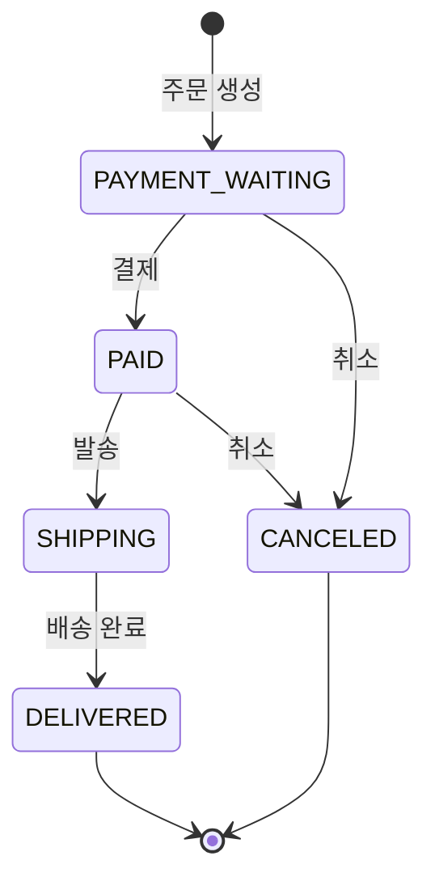

# e-commerce (잡화 커머스)

Java · Spring Boot 기반 잡화 커머스 백엔드 포트폴리오. 상품 · 장바구니 · 주문 · 어드민을 다루며,
**주문 시 재고 차감 동시성 제어 / N+1 문제 해결 / 운영자 어드민**을 깊게 파는 것을 목표로 한다.

## 기술 스택
- Java 17, Spring Boot 3.4
- Spring Data JPA (Hibernate), Validation, Lombok
- MySQL 8 (운영/개발), H2 (테스트)
- Gradle (Wrapper 포함)

## 현재까지
**1단계 — 도메인 설계**
- 프로젝트 세팅, DB 연결 설정
- 도메인 엔티티 7종 + 연관관계 설계
  - `Member`, `Category`, `Product`, `CartItem`, `Order`, `OrderItem`, `Review`
  - 모든 `@ManyToOne`은 `LAZY`, 양방향은 `Order ↔ OrderItem` 뿐
- 기본 Repository, H2 기반 동작 확인 테스트

**2단계 — 상품·카테고리 조회 API**
- Controller → Service → Repository 3계층
- 엔티티 → DTO 변환(`ProductResponse.from(...)`)
- 상품 목록 페이징·정렬(`Pageable`) + 카테고리 필터 + 이름 검색
- `@RestControllerAdvice` 전역 예외 처리 + 통일된 에러 응답

**3단계 — 회원 + Spring Security JWT 인증**
- 회원가입(BCrypt 암호화) / 로그인 → JWT 발급
- `OncePerRequestFilter` 기반 JWT 검증 필터 → `SecurityContext`에 인증정보 저장
- `SecurityFilterChain`(Spring Security 6): STATELESS · CSRF off · 엔드포인트별 인가
- 역할 기반 인가(USER / ADMIN), 401(EntryPoint)/403(AccessDeniedHandler) JSON 통일

**4단계 — 장바구니 · 주문 · 재고 동시성 제어 ⭐**
- 장바구니 담기(수량 합산)/조회/삭제(본인 소유 검증)
- 주문 생성: 재고 차감 + 주문 시점 가격 스냅샷 + 총액, `@Transactional`로 원자성 보장
- **재고 차감 동시성 제어(비관적 락)** — 초과 판매 방지, 동시 주문 테스트로 증명
- 주문 조회(목록 페이징 / 상세) + **N+1 → fetch join 개선**(쿼리 5→1)

**5단계 — 어드민(운영자) 기능 ⭐**
- 상품 관리: 등록 / 수정 / 재고 입고 / 판매상태 변경 (엔티티 메서드로 규칙 응집)
- **주문 상태 전이**: `OrderStatus`에 전이 규칙 정의, 허용된 전이만 가능(위반 시 400), 취소 시 재고 복구
- 어드민 조회: 상태별 주문(요약 DTO로 N+1 회피) / 재고 부족 상품
- 모든 `/api/admin/**`는 `hasRole("ADMIN")` 보호 (USER 접근 시 403)

## 실행 방법

### 1) 로컬 MySQL 띄우기 (Docker)
```bash
docker compose up -d
```
- MySQL 8이 `localhost:3306`에 뜬다. DB: `commerce`, 계정: `commerce / commerce1234`

### 2) 애플리케이션 실행
```bash
./gradlew bootRun
```

### 3) 테스트 (H2 메모리 DB, Docker 불필요)
```bash
./gradlew test
```

## 패키지 구조
```
com.example.ecommerce
├── domain/       # 엔티티 + Enum
├── repository/   # Spring Data JPA Repository
├── service/      # 비즈니스 로직
├── controller/   # REST API
├── dto/          # 요청·응답 DTO
└── global/       # 공통 (BaseTimeEntity, 전역 예외 처리, 시드 데이터)
```

## 인증 흐름

```
회원가입(POST /api/auth/signup)  →  로그인(POST /api/auth/login) → JWT 획득
   →  이후 요청 헤더에 실어 호출:  Authorization: Bearer <accessToken>
```

시드 계정(앱 실행 시 자동 생성):
- 관리자: `admin@example.com` / `admin1234` (ADMIN)
- 일반: `user@example.com` / `user1234` (USER)

## API 문서

### 권한별 엔드포인트

| 메서드 | 경로 | 설명 | 접근 권한 |
|---|---|---|---|
| POST | `/api/auth/signup` | 회원가입 | 누구나 |
| POST | `/api/auth/login` | 로그인(JWT 발급) | 누구나 |
| GET | `/api/products` | 상품 목록(페이징·필터·검색) | 누구나 |
| GET | `/api/products/{id}` | 상품 상세 | 누구나 |
| GET | `/api/categories` | 카테고리 전체 | 누구나 |
| GET | `/api/members/me` | 내 정보 조회 | 인증 필요 (USER/ADMIN) |
| POST | `/api/cart` | 장바구니 담기 | 인증 필요 |
| GET | `/api/cart` | 내 장바구니 조회 | 인증 필요 |
| DELETE | `/api/cart/{cartItemId}` | 장바구니 항목 삭제(본인) | 인증 필요 |
| POST | `/api/orders` | 주문 생성 | 인증 필요 |
| GET | `/api/orders` | 내 주문 목록(페이징) | 인증 필요 |
| GET | `/api/orders/{id}` | 주문 상세(본인) | 인증 필요 |
| POST | `/api/admin/products` | 상품 등록 | ADMIN 전용 |
| PATCH | `/api/admin/products/{id}` | 상품 정보 수정 | ADMIN 전용 |
| PATCH | `/api/admin/products/{id}/stock` | 재고 입고 | ADMIN 전용 |
| PATCH | `/api/admin/products/{id}/status` | 판매상태 변경 | ADMIN 전용 |
| GET | `/api/admin/products/low-stock` | 재고 부족 상품(`?threshold=10`) | ADMIN 전용 |
| PATCH | `/api/admin/orders/{id}/status` | 주문 상태 변경 | ADMIN 전용 |
| GET | `/api/admin/orders` | 전체 주문(`?status=&page=&size=`) | ADMIN 전용 |

- 인증 없이 보호 엔드포인트 접근 → **401** `{ "status":401, "message":"인증이 필요합니다." }`
- 권한 부족(USER가 ADMIN 영역) → **403** `{ "status":403, "message":"접근 권한이 없습니다." }`

### 조회 API 파라미터

| 메서드 | 경로 | 주요 파라미터 |
|---|---|---|
| GET | `/api/products` | `page`, `size`, `sort`(예: `price,desc`), `categoryId`, `keyword` |

### 응답 예시

`GET /api/products?page=0&size=5&sort=price,desc`
```json
{
  "content": [
    { "id": 2, "name": "우드 도마", "price": 15900, "stockQuantity": 40,
      "status": "ON_SALE", "categoryId": 1, "categoryName": "주방" }
  ],
  "totalElements": 8,
  "totalPages": 2,
  "number": 0,
  "size": 5,
  "first": true,
  "last": false
}
```

`GET /api/products/9999` (없는 상품)
```json
{ "status": 404, "message": "상품을 찾을 수 없습니다. id=9999" }
```

### curl 예시
```bash
# 페이징 + 가격 내림차순 정렬
curl "http://localhost:8080/api/products?page=0&size=5&sort=price,desc"

# 카테고리 필터
curl "http://localhost:8080/api/products?categoryId=1"

# 이름 검색
curl "http://localhost:8080/api/products?keyword=머그"

# 상품 상세 / 없는 상품(404)
curl "http://localhost:8080/api/products/1"
curl -i "http://localhost:8080/api/products/9999"

# 카테고리 목록
curl "http://localhost:8080/api/categories"
```

### 인증 curl 예시
```bash
# 1) 회원가입
curl -X POST http://localhost:8080/api/auth/signup \
  -H "Content-Type: application/json" \
  -d '{"email":"kim@example.com","password":"pass1234","name":"김철수"}'

# 2) 로그인 → 토큰 획득 (아래는 토큰만 뽑아 변수에 저장하는 예)
TOKEN=$(curl -s -X POST http://localhost:8080/api/auth/login \
  -H "Content-Type: application/json" \
  -d '{"email":"user@example.com","password":"user1234"}' | jq -r .accessToken)

# 3) 토큰으로 보호된 엔드포인트 호출
curl http://localhost:8080/api/members/me -H "Authorization: Bearer $TOKEN"

# 4) 토큰 없이 → 401 / USER로 어드민 → 403
curl -i http://localhost:8080/api/members/me
curl -i http://localhost:8080/api/admin/ping -H "Authorization: Bearer $TOKEN"
```

> 앱 실행 시 `DataInitializer`가 카테고리 3종 + 상품 8개 + 시드 계정(admin/user)을 자동으로 넣는다(비어 있을 때만).
>
> **보안 주의:** `jwt.secret`은 개발용 기본값이 들어 있다. 운영에서는 반드시 환경변수 `JWT_SECRET`으로 길고 무작위한 값을 주입한다.

## ⭐ 핵심: 재고 차감 동시성 제어

인기 상품에 **동시에 여러 주문**이 몰리면, 락 없이는 재고 검증이 무력화되어 **초과 판매**가 발생한다.

### 문제 재현 → 해결 → 증명
`ExecutorService` + `CountDownLatch`로 **100개 스레드가 재고 10개 상품을 동시에 주문**하는 테스트
(`OrderConcurrencyTest`)로 검증했다.

| | 락 없음 (before) | 비관적 락 (after) |
|---|---|---|
| 성공 주문 | **81건** (초과 판매!) | **10건** |
| 남은 재고 | 0 (81개 팔림) | 0 (정확히 10개) |
| 테스트 | ❌ FAIL | ✅ PASS |

### 원인과 해결
- **원인**: 여러 트랜잭션이 동시에 같은 재고를 읽고(stale read) 각자 차감·커밋 → 서로의 변경을 덮어씀(lost update).
- **해결**: 재고 조회에 **비관적 쓰기 락**(`@Lock(PESSIMISTIC_WRITE)` → `SELECT ... FOR UPDATE`)을 적용.
  같은 상품 행을 잠가, 재고 차감을 **한 번에 하나씩 직렬화**한다.
- **선택 근거**: 재고 차감은 충돌이 잦고 트랜잭션이 짧아 비관적 락이 적합. (낙관적 락은 충돌마다 재시도가 폭증)

```java
// ProductRepository
@Lock(LockModeType.PESSIMISTIC_WRITE)
@Query("select p from Product p where p.id = :id")
Optional<Product> findByIdForUpdate(@Param("id") Long id);
```

### N+1 문제 개선 (주문 상세 조회)
- 주문 상세를 `findById`로 조회하면 `주문 → 주문상품 → 상품`을 따라가며 쿼리가 **5번**(항목 수에 비례) 발생.
- `join fetch`로 한 번에 로딩하도록 개선 → **쿼리 1번**.

```java
@Query("select o from Order o join fetch o.orderItems oi join fetch oi.product where o.id = :id")
Optional<Order> findByIdWithItems(@Param("id") Long id);
```

### 주문 curl 예시
```bash
TOKEN=$(curl -s -X POST http://localhost:8080/api/auth/login \
  -H "Content-Type: application/json" \
  -d '{"email":"user@example.com","password":"user1234"}' | jq -r .accessToken)

# 장바구니 담기 → 조회
curl -X POST http://localhost:8080/api/cart -H "Authorization: Bearer $TOKEN" \
  -H "Content-Type: application/json" -d '{"productId":1,"quantity":2}'
curl http://localhost:8080/api/cart -H "Authorization: Bearer $TOKEN"

# 주문 생성 → 목록 → 상세
curl -X POST http://localhost:8080/api/orders -H "Authorization: Bearer $TOKEN" \
  -H "Content-Type: application/json" -d '{"items":[{"productId":1,"quantity":2},{"productId":4,"quantity":1}]}'
curl "http://localhost:8080/api/orders?page=0&size=10" -H "Authorization: Bearer $TOKEN"
curl http://localhost:8080/api/orders/1 -H "Authorization: Bearer $TOKEN"
```

### 동시성 테스트 실행
```bash
./gradlew test --tests "com.example.ecommerce.OrderConcurrencyTest"
```

## ⭐ 어드민: 주문 상태 전이 설계

주문 상태를 아무렇게나 바꾸지 못하도록 **허용된 전이만** 도메인(`OrderStatus`)에서 검증한다.

### 상태 전이 다이어그램


| 현재 상태 | 갈 수 있는 상태 | 규칙 근거 |
|---|---|---|
| `PAYMENT_WAITING` 결제대기 | `PAID`, `CANCELED` | 결제 또는 결제 전 취소 |
| `PAID` 결제완료 | `SHIPPING`, `CANCELED` | 발송 또는 발송 전 취소 |
| `SHIPPING` 배송중 | `DELIVERED` | **취소 불가** (이미 출고) |
| `DELIVERED` 배송완료 | — | 종료 상태 |
| `CANCELED` 취소 | — | 종료 상태(취소 시 재고 복구) |

- 전이 규칙은 `OrderStatus.canTransitionTo(next)`에 정의하고, `Order.changeStatus()`를 **유일한 창구**로 강제.
- 허용되지 않은 전이는 `InvalidOrderStatusException` → **400**. (`OrderStatusTransitionTest`로 검증)
- **왜 도메인에 두나**: 상태 규칙이 서비스/컨트롤러에 흩어지면 검증 누락이 생긴다. 상태 자신(enum)이 규칙을 알게 하면 어디서 호출하든 안전.

### 어드민 curl 예시
```bash
ATOK=$(curl -s -X POST http://localhost:8080/api/auth/login \
  -H "Content-Type: application/json" \
  -d '{"email":"admin@example.com","password":"admin1234"}' | jq -r .accessToken)

# 상품 등록 / 재고 입고 / 상태 변경
curl -X POST http://localhost:8080/api/admin/products -H "Authorization: Bearer $ATOK" \
  -H "Content-Type: application/json" \
  -d '{"categoryId":1,"name":"신상 텀블러","price":18000,"stockQuantity":5,"description":"신규"}'
curl -X PATCH http://localhost:8080/api/admin/products/1/stock -H "Authorization: Bearer $ATOK" \
  -H "Content-Type: application/json" -d '{"quantity":20}'

# 주문 상태 전이 (허용 안 된 전이는 400)
curl -X PATCH http://localhost:8080/api/admin/orders/1/status -H "Authorization: Bearer $ATOK" \
  -H "Content-Type: application/json" -d '{"status":"SHIPPING"}'

# 어드민 조회
curl "http://localhost:8080/api/admin/orders?status=PAID" -H "Authorization: Bearer $ATOK"
curl "http://localhost:8080/api/admin/products/low-stock?threshold=10" -H "Authorization: Bearer $ATOK"
```
